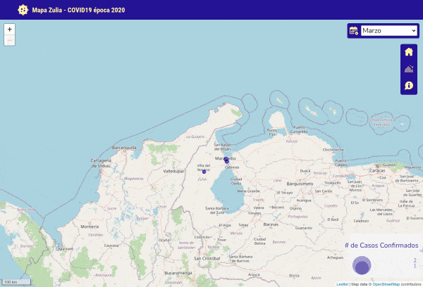

# Mapa Zulia - COVID19
Plantilla  de diseño web adaptable  (del ingles _responsive web design_) 
para crear aplicaciones de mapas web con __LeafletJS__.

Este mapa interactivo, tiene la intención de mostrar las potencialidades 
del manejo de la __información geográfica__ para dar una nueva perspectiva, 
al manejo de la emergencia sanitaria ocurrida después 
de la epidemia del __coronavirus__, desatada en Wuhan, China, en Diciembre de 2019.

## :eye_speech_bubble: Overview

## Demo

[Demo](http://jfcoordenadas.xyz/mapa_covid/)

## :keyboard: Framework
- [Leaflet JS](https://leafletjs.com/)
- [ChartJS](https://www.chartjs.org/)

### Plugin Leaflet

-[Leaflet Control Custom](https://github.com/yigityuce/Leaflet.Control.Custom)

## :bust_in_silhouette: Contactos
- Twitter : https://twitter.com/juancho_2306

## Licencia
Este proyecto está bajo la Licencia [MIT](/LICENSE) - mira el archivo [LICENSE.md](LICENSE.md) para detalles.
